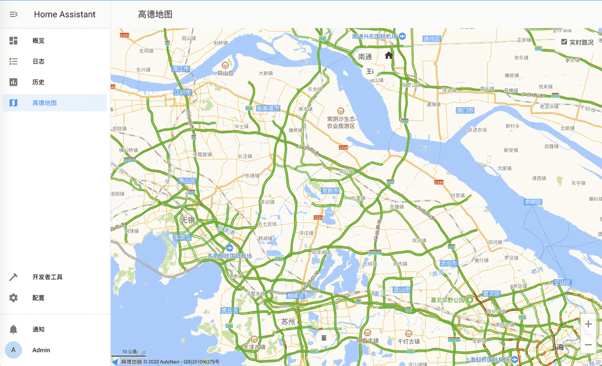
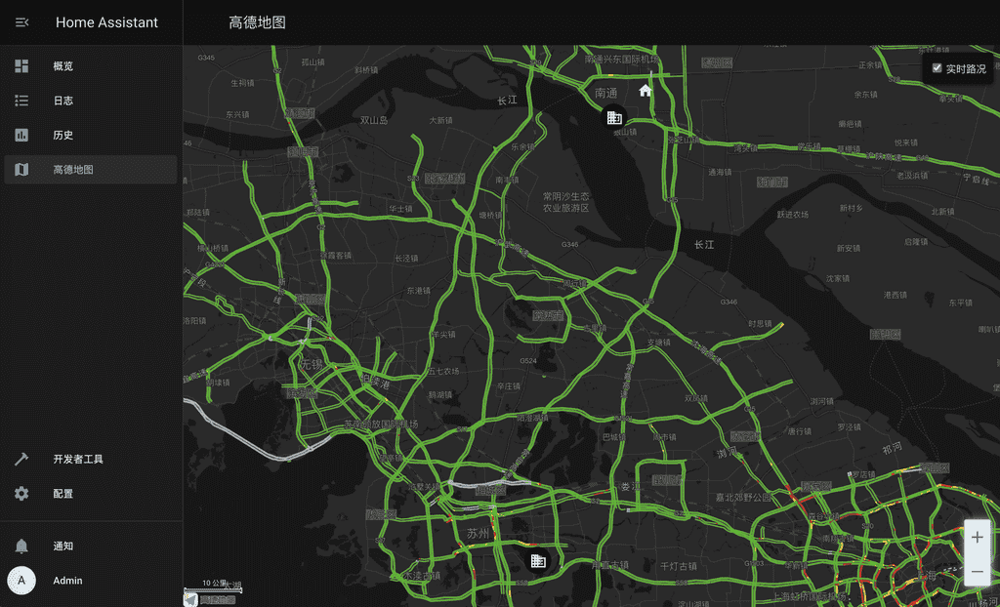

# ha-panel-amap-panel
Amap map panel for home assistant

## 使用
1. 将 amap文件夹 放入 home assistant 的 www 文件夹。
2. 配置 configuration.yaml 文件，加入如下配置：

```yaml
panel_custom:
    - name: amap-panel
      sidebar_title: 高德地图
      sidebar_icon: mdi:map
      module_url: /local/amap/amap-panel.js
      trust_external_script: true
      config:
          key: 高德地图Web端key
          amap_devices: # 高德坐标系设备
            - device_tracker.xxx
          baidu_devices: # 百度坐标系设备
            - device_tracker.xxx
```
3. 重启 home assistant, enjoy your self!
4. ⚠️注意：默认支持的是GPS设备坐标，如果发现自己的坐标是高德或者百度坐标系，请使用 `amap_devices` `baidu_devices` 配置！

## 截图
1. 浅色模式

2. 深色模式


## 问题
```
有问题请提issue，谢谢！
```
1. 高德地图key申请 https://lbs.amap.com/dev/key/app

## 日志
```
2022-01-16
1.[特性]增加GCJ02坐标的设备配置，防止再次坐标转换（感谢 @yongman）

2020-09-23
1.[特性]适配最新版本的 Home Assistant（yaml配置跟文件放置路径都发生了变化）
2.[特性]增加深色模式（根据设置里面配置的主题自动选择模式）
3.[修复]修复在设备距离比较分散的时候，地图不能选择正确的比例显示所有图标

2019-12-07
1.修复zone图标不居中问题
2.优化设备位置更新算法，设备位置刷新更平滑

2019-12-02
1.修复首次加载白屏
2.修复图标偏移
3.使用通用坐标转换方法，修复坐标不正确的问题
4.略微放大了设备图标
```
